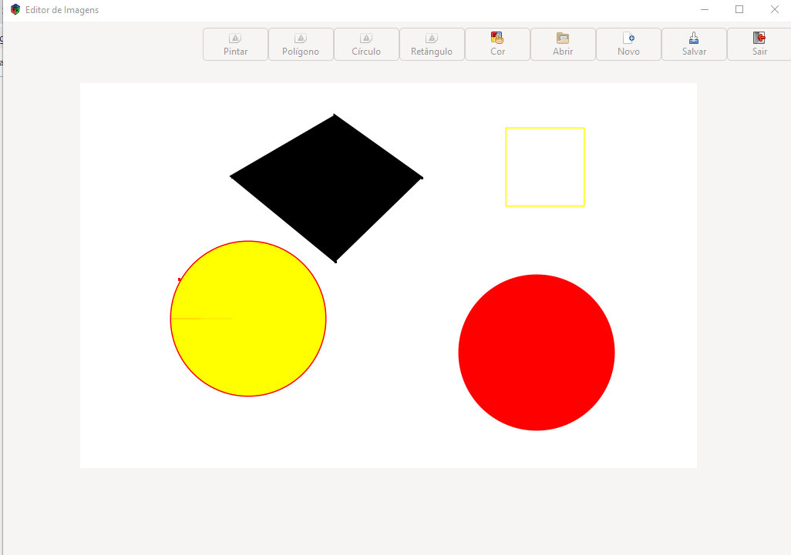

# ProjetoITP
# Editor de imagem usando C e GTK/Glade

# Funções:

1. **_Desenhar polígono_** 
Desenha um polígono a partir de pontos determinados pelo usuário através de click's. :space_invader:

2. **_Desenhar círculo_** 
Desenha um círculo a partir de um ponto determinado pelo usuário através de um click, considerando o ponto fornecido como centro da circunferência.

3. **_Desenhar retângulo_** 
Desenha um retângulo a partir de um ponto fornecido pelo usuário por meio de um click na área de desenho.

4. **_Função Pintar_** 
Aapós desenhar um polígono o usuário pode preenchê-lo com a cor previamente selecionada pela função cor.

5. **_Função Cor_** 
Abre uma caixa de diálogo com uma paleta de cores onde o usuário pode escolher a cor desejada, essa função muda a cor da linha de desenho e do preenchimento dos polígonos.

6. **_Gerar nova Imagem_** 
Essa função apaga a área de desenho e cria uma nova superfície em branco para um novo desenho.

7. **_Abrir Imagem_** 
A função lê um arquivo .PPM na versão textual, e o exibe na área de desenho.

8. **_Salvar Imagem_** 
Função responsável por salvar tudo o que foi desenhado num arquivo .PPM na versão textual.

# Como compilar o projeto?
Foi desenvolvido um pequeno passo a passo para configuração do ambiente de trabalho para rodar o código sem dor de cabeça! :sunglasses:
### Clique aqui: [Tutorial](https://github.com/jardelmfonseca/ProjetoITP/blob/master/Configurando%20Ambiente%20GTK%20_codeBlocks.pdf) 

# O que poderia ter sido feito diferente?
Para concretização do projeto foi utilizada a biblioteca *Cairo* que consiste numa poderosa ferramente para desenhar em 2d. Os modelos de desenho *Cairo* abstraem o contexto e auxiliam o programador a desenvolver de maneira mais ágil. 

Poderíamos ter construído todas as funções manualmente, porém demandaria mais tempo e mesmo assim não teríamos o mesmo resultado final ao implementar a interface gráfica com GTK 3.:sweat_smile:
